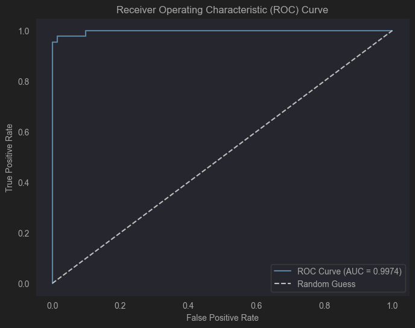
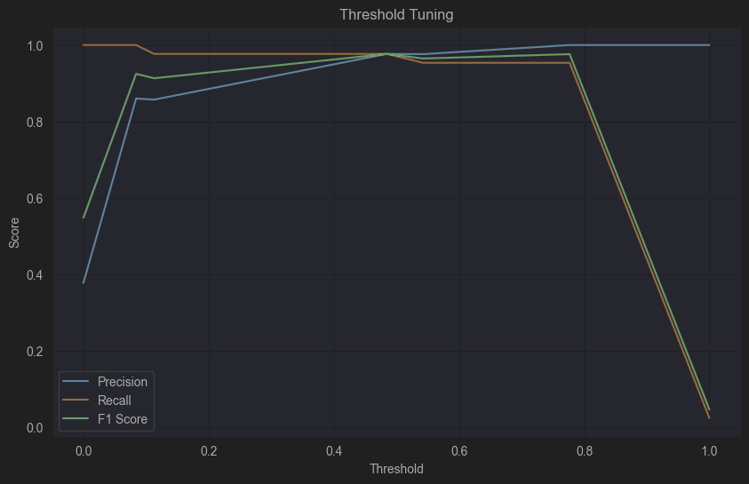

# Elevate-Labs-Task-4
## Name : Tenzin Kunga 
## 30/3/2025
___
* Objective: Build a binary classifier using logistic regression.
* Tools: Scikit-learn, Pandas, Matplotlib
___
### Import all the necessary libraries
```python
import pandas as pd
import numpy as np
import matplotlib.pyplot as plt
from sklearn.model_selection import train_test_split
from sklearn.linear_model import LogisticRegression
from sklearn.preprocessing import StandardScaler
from sklearn.metrics import (
    accuracy_score, confusion_matrix, precision_score,
    recall_score, f1_score, roc_auc_score, roc_curve
)
```
___
### Load DATA
```python
data = pd.read_csv('Breast Cancer Wisconsin Dataset.csv')
```
___
### Check for NULL values
Incase of Null values preprocess to handle the null values.
```python
df.isnull().sum()
```
___
### Binary classification
Converts object "M" & "B" i.e Malignant (Cancerous tumor) & Benign (Non-cancerous tumor) respectively into numerical values of 1 and 0.
```python
# Convert diagnosis to binary
df['diagnosis'] = df['diagnosis'].map({'M': 1, 'B': 0})

# Separate features and target
X = df.drop(['diagnosis', 'id', 'Unnamed: 32'], axis=1, errors='ignore')
y = df['diagnosis']
```
___
### Train-test-split
```python
X_train, X_test, y_train, y_test = train_test_split(X, y, test_size=0.2, random_state=42)
```
___
### Standardize the features
```python
scaler = StandardScaler()
X_train_scaled = scaler.fit_transform(X_train)
X_test_scaled = scaler.transform(X_test)
```
___
### Train Logistic Regression model
```python
model = LogisticRegression(max_iter=1000)
model.fit(X_train_scaled, y_train)
```
___
### Predict
```python
y_pred = model.predict(X_test_scaled)
y_proba = model.predict_proba(X_test_scaled)[:, 1]
```
___
### Model Evaluation
Using `accuracy_score`, `confusion_matrix`,`precision_score`,`recall_score`,`f1_score`,`roc_auc_score`.
```python
acc = accuracy_score(y_test, y_pred)
conf_matrix = confusion_matrix(y_test, y_pred)
precision = precision_score(y_test, y_pred)
recall = recall_score(y_test, y_pred)
f1 = f1_score(y_test, y_pred)
roc_auc = roc_auc_score(y_test, y_proba)
```

Outoput
```markdown
Accuracy: 0.9737
Confusion Matrix:
 [[70  1]
 [ 2 41]]
Precision: 0.9762
Recall: 0.9535
F1 Score: 0.9647
ROC-AUC Score: 0.9974
```
This shows the model is highly accurate with the accuracy of 0,9737 or 97.37%.
___
### ROC Curve

___
### Threshold Tuning
